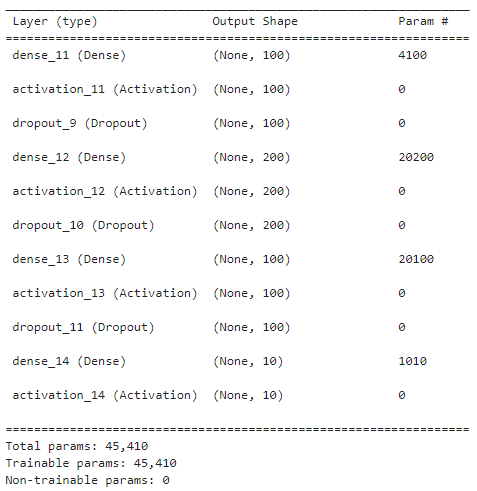

# Audio Classification using ANN (Artificial Neural Network) with TensorFlow

## Project Overview

This repository contains code for a simple audio classification project using Artificial Neural Networks (ANN) implemented with TensorFlow. The model achieves 81% accuracy on the dataset downloaded from [UrbanAudio8K](https://urbansounddataset.weebly.com/urbansound8k.html).

## Installation

Provide instructions on how to install any dependencies and set up the project environment.

```bash
pip install -r requirements.txt
```

## Usage

Run `jupyter-notebook`

## Dataset

source: [UrbanAudio8K](https://urbansounddataset.weebly.com/urbansound8k.html), Fill the form and download the data

## Model Architecture


## Results

optained `accuracy` of `81%` 


## Acknowledgments

[Krish C Naik](https://github.com/krishnaik06)

```
Part 1 : https://youtu.be/mHPpCXqQd7Y?si=PbR9i0M4BbNVdBr_ 
```
```
Part 2 : https://youtu.be/4F-cwOkMdTE?si=uBulPsAuG33pGAQJ
```
```
Part 3 : https://youtu.be/uTFU7qThylE?si=Higj7KXMCJjOHnGO
```
```
Part 4: https://youtu.be/cqndT517NcQ?si=nxSGMBXbBkPg5dRx
```